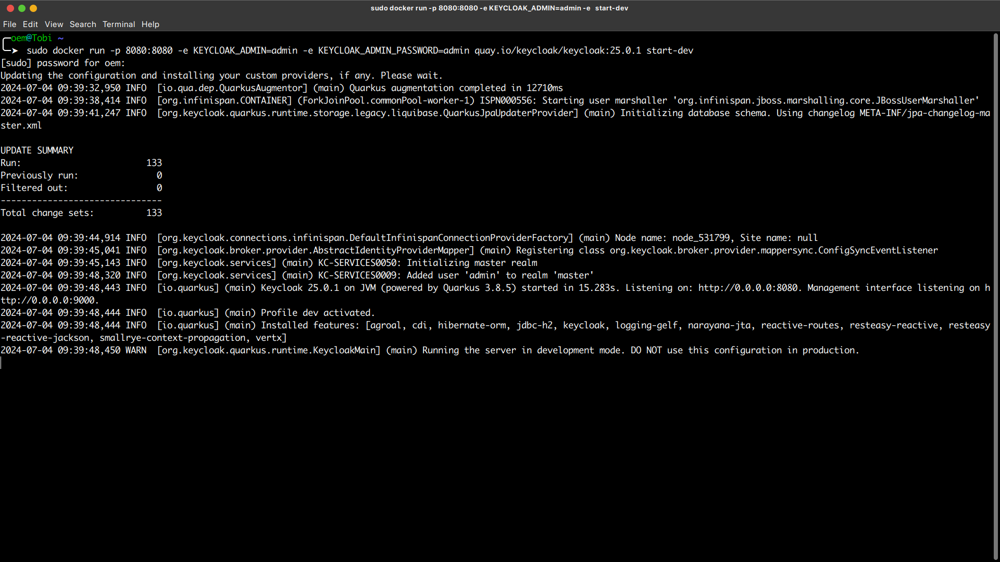

# keycloak-practice

Practicing how to use Keycloak with an Express server API.

## Quickstarts

Proceed by forking or cloning this repository.

To clone:

```sh
# via HTTP:
git clone https://github.com/biggaji/keycloak-practice.git

# via SSH:
git clone git@github.com:biggaji/keycloak-practice.git
```

## Keycloak Setup

Please download the [Keycloak server](https://www.keycloak.org/downloads). For an easy setup, I suggest using
the Docker option.

Ensure you have Docker installed on your local machine. If not, get Docker
[here](https://docs.docker.com/get-docker/).

## Installing Keycloak Image via Docker

In your terminal, run:

```sh
docker pull quay.io/keycloak/keycloak
```

Once the installation is complete, start the Keycloak server using this command in your terminal:

```sh
docker run -p 8080:8080 -e KEYCLOAK_ADMIN=admin -e KEYCLOAK_ADMIN_PASSWORD=admin quay.io/keycloak/keycloak:25.0.1 start-dev
```

Once the server is running, you will see this message in your terminal:



## Configuring Keycloak

### Access the Keycloak Admin Console

- Open your browser and navigate to [http://localhost:8080](http://localhost:8080).
- Log in with the credentials: username `admin` and password `admin`.

### Create a Realm

- In the Keycloak admin console, click on `Add Realm`.
- Enter a name for your realm (e.g., `myrealm`) and click `Create`.

### Create a Client

- Navigate to `Clients` and click `Create`.
- Set `Client ID` to `express-server`.
- Set `Client Protocol` to `openid-connect`.
- Set `Access Type` to `public`.
- Click `Save`.
- Configure the client:
  - **Root URL**: `http://localhost:3000`
  - **Valid Redirect URIs**: `http://localhost:3000/*`
  - **Web Origins**: `http://localhost:3000`
  - **Client Authentication**: Ensure client authentication is enabled and note the `Client Secret`.

## Running the Express Server

### Prerequisites

Ensure you have Node.js and npm installed on your machine. If not, download and install them from Node.js.

### Setting Up the Project

#### Install Required Dependencies

```sh
# via yarn
 yarn install

 # via npm
 npm install
```

#### Create a .env File

Create a .env file in the root of your project with the following content:

```
SESSION_SECRET=your_session_secret
```

#### Create keycloak.json

Place this file in the root of your project:

```json
{
  "realm": "myrealm",
  "auth-server-url": "http://localhost:8080",
  "ssl-required": "external",
  "resource": "express-server",
  "public-client": true,
  "confidential-port": 0
}
```

#### Run the Server

```sh
node index.js
```

### Project Structure

- `index.js`: The main file where the Express server and Keycloak are configured.
- `keycloak.json`: Configuration file for Keycloak.

### Contribution

Feel free to contribute to this repository by forking and creating pull requests for improvements and
additional features.
